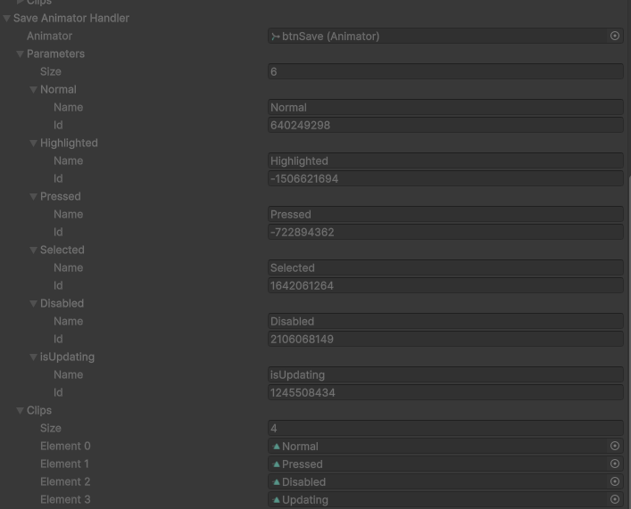

[Portuguese](../README.md) | [Korean](./README-ko.md)

# ASPax Handlers

## Overview

**ASPax Handlers** is a collection of C# scripts for the Unity Engine, designed to simplify and enhance the handling of specific components like `Animator` and `Transform`. The main goal is to provide safe, efficient, and easy-to-use access to complex functionalities, as well as to optimize runtime performance.

This package is ideal for developers looking to streamline their workflow, reduce code verbosity, and ensure that interactions with Unity components are more robust and less prone to errors.

## Features

### AnimatorHandler

The `AnimatorHandler` class offers a structured way to access and manage the properties of an `Animator` component.

> **Important:** This class needs to be instantiated (`new`) and cannot be added as a component to a GameObject. Therefore, it is not possible to use `GetComponent` to access it.

**Instantiation Example:**

It is recommended to instantiate the class in the `Start()` or `Awake()` method:

```csharp
public Animator animator;
public ASPax.Handlers.AnimatorHandler animatorHandler;

void Awake()
{
    animator = GetComponent<Animator>();
}

void Start()
{
    animatorHandler = new(animator);
}
```

**Key Features:**

- **`Animator`**: Returns the associated `Animator` component.
- **`Parameters`**: Returns an array of `AnimatorControllerParameter`, allowing access to all controller parameters.
- **`ParameterHandlers`**: Returns an array of `ParameterHandler` (struct), which facilitates the manipulation of `Animator` parameters using their IDs instead of names (strings), improving performance.
- **`AnimationClips`**: Returns an array with all `AnimationClip` present in the `Animator Controller`.
- **`IsNecessaryUpdateInstance()`**: Checks if the `AnimatorHandler` instance needs to be updated, for example, if the parameters or animation clips have been changed.

#### `ParameterHandler` Struct

This struct was created to optimize access to `Animator` parameters. By using the parameter's ID (`int`) instead of its name (`string`), costly string comparisons at runtime are avoided.

**Features:**

- **`Name`**: The name of the parameter.
- **`ID`**: The hash of the parameter's name, used to identify it efficiently.

**Usage Example:**

```csharp
public Animator animator;
public ASPax.Handlers.AnimatorHandler.ParameterHandler animatorParameter = new("isOpen");

void Awake()
{
    animator = GetComponent<Animator>();
}

public void ToggleAnimation(bool isOpen)
{
    animator.SetBool(animatorParameter.ID, isOpen);
}
```

### TransformHandler

`TransformHandler` is a component that inherits from `UIBehaviour` and can be added to a GameObject to facilitate access and manipulation of `Transform` and `RectTransform` properties. It works in both edit mode and runtime (`ExecuteAlways`).

**Key Features:**

- **Safe Property Access:** Provides safe access to `Position`, `Rotation`, `Scale`, and other `Transform` properties. `TransformHandler` includes checks to prevent `NaN` (Not a Number) values, which can cause unexpected behavior.
- **`RectTransform` Support:** Automatically detects if the GameObject has a `RectTransform` and enables specific functionalities, such as `AnchoredPosition` and `Ratio` calculations.
- **Coordinate Conversion:** Includes methods to convert positions between screen and world coordinates.
- **Ratio Calculation:** For `RectTransform`, calculates the `Ratio` between width and height, with an adjustable `RangeRatioHandler` for different layout needs.
- **Real-Time Updates:** Properties are automatically updated in the Inspector when changes occur, facilitating debugging and visualization.

## Project Goals

- **Simplify Interaction:** Reduce complexity when interacting with Unity components.
- **Improve Performance:** Prioritize the use of more efficient methods, such as accessing animation parameters by ID.
- **Increase Safety:** Implement checks to prevent common errors, such as `NaN` values in vectors and quaternions.
- **Facilitate Debugging:** Display relevant and easy-to-read information in the Inspector, with `ReadOnly` fields to prevent accidental modifications.

## Notes

- **Serialization:** Both `AnimatorHandler` and `TransformHandler` are serializable, which means their properties can be viewed in the Unity Inspector.
- **Custom Attributes:** The project uses the `ASPax.Attributes` library, which enriches the Inspector with features like `ReadOnly`, `ShowIf`, and `HorizontalLine`, improving the organization and clarity of information.
- **Dependencies:** This package has a dependency on `com.adrianuspax.attributes`, which must be installed for the custom attributes to work correctly.
- **Edit Mode:** `TransformHandler` is designed to work in Unity's edit mode, allowing developers to see changes in real-time without needing to run the scene.

## Visual Example

The image below demonstrates how `AnimatorHandler` displays animation parameters and clips in the Inspector, making it easy to identify the index of each element.

