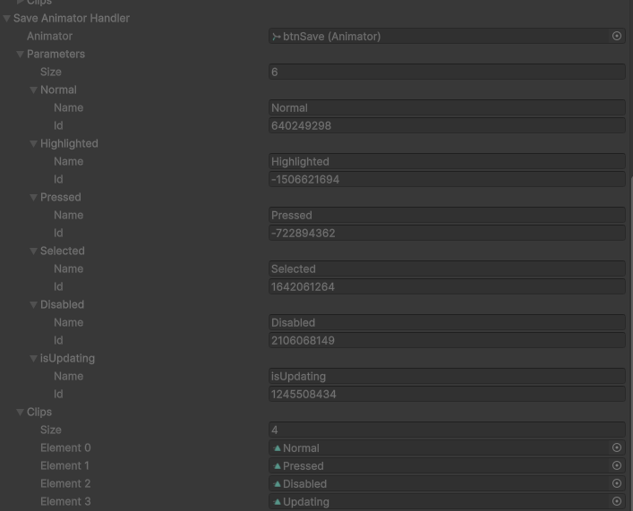

# Handlers
## Propósito
 Scripts em *C#* para a *Game Engine* **Unity** para facililitar e/ou ajudar na manipulação de *components* específicos utilizados.
 ## Recursos
 ### AnimatorHandler
 Classe utilizado para retornar informações e elementos do componente *Animator*.
 > Esta classe precisa ser instanciada, ou seja, use `new` e atribua o devido valor ao atributo, portanto, não é usado como componente, o que implica que não é possível usar `GetComponent` da biblioteca `UnityEngine`.

 É recomendável que se instancie a classe no método `void Start()`.

 ```csharp
 public Animator aniamtor;
 public ASPax.Handlers.AnimatorHandler animatorHandler;

 public void Awake()
 {
    animator = GetComponent<Animator>();
 }

 public void Start()
 {
    animatorHandler = new(animator);
 }
 ```

 #### Principais Recursos
 - **Animator** -> Propriedade que retorna o componente *Animator*.
 - **ControllerParameters** -> Propriedade que retorna uma *array* de *AnimatorControllerParameter*.
    - É o mesmo que *animator.parameters*.
- **Parameters** -> Propriedade que retorna o *struct* criado para manipular os parâmetros do *animator*.
- **Clips** -> Retorna uma *array* de *AnimationClip*.
- **IsInstanstiated** -> Retorna *true* se a classe for instanciada com sucesso.
### Struct Parameter
*Struct* que é usado para manipular as informações dos parâmetros do componente *Animator*.

Este recurso é útil para atribuir o parâmetro usado do componente *Animator* pelo seu *ID* e não pelo nome do parâmetro em si que é uma *string* priorizando a performance do seu aplicativo/game em desenvolvimento.
#### Principais recursos
- **Name** -> Retorna o nome do parâmetro que foi atribído ao *construct*.
- **ID** -> Retorna o *ID* do parâmetro que foi atrbuído ao *construct*.
    - É o mesmo que usar `Animator.StringToHash(name);`.

```csharp
public Aniamtor animator;
public ASPax.Handlers.AnimatorHandler.Parameter animatorParameter = new("isOpen");

public void Awake()
{
    animator = GetComponent<Animator>();
}

public void StartAnimatimation(bool isOpen)
{
    animator.SetBool(animatorParameter.ID, isOPen);
}
```

### Observações
Tanto a classe quando o *struct* são serializáveis, ou seja, é possível visualizar no *inspector* do **Unity** todos os objetos que foram atribídos.
Como a classe possui a bilbioteca `ASPax.Attributes`, muitos valores no inspector não são manipuláveis, sendo possível apenas serem observados.



Portanto, para saber qual valor de *array* por índice deve-se ser esoclhido para retornar o valor correto desejado, observe no *inspector*.